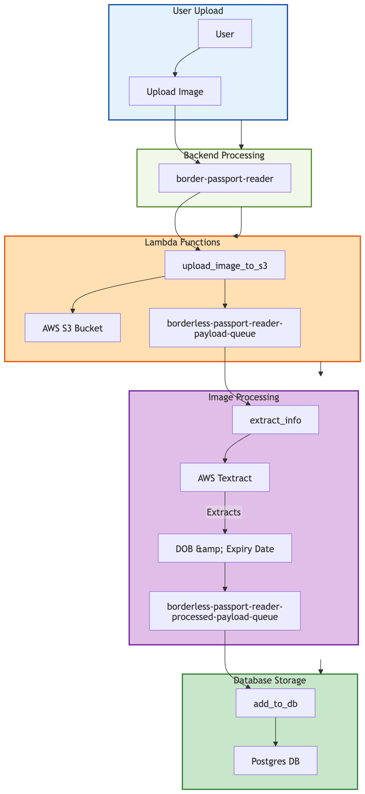

# **borderless-passport-reader**

This project is the backend for a passport reading application built using AWS services. It processes passport images, extracts important information like the date of birth (DOB) and expiry date, and stores it in a Postgres database.

## **Overview**

This backend utilizes AWS Lambda, S3, SQS, AWS Textract, and Postgres to perform the following operations:

1. **Upload Passport Image**: The user uploads an image to the frontend application built with React.js.
2. **Upload Image to S3**: The image is uploaded to an S3 bucket via a Lambda function.
3. **Extract Information**: The Lambda function processes the uploaded image with AWS Textract to extract the DOB and expiry date from the passport.
4. **Queueing**: The extracted data is passed through SQS queues to maintain a decoupled and scalable system.
5. **Insert into Database**: The extracted information is inserted into a Postgres database via another Lambda function.

---

## **Flow Diagram**



---

## **Architecture**

- **Frontend**: `passport-uploader` built on React.js
- **Backend**: `border-passport-reader` built on TypeScript, deployed using the AWS Serverless Framework
- **AWS Services**: 
  - **AWS Lambda**: Handles the core logic and workflows
  - **AWS S3**: Stores the uploaded passport images
  - **AWS SQS**: Handles the queuing of image processing tasks
  - **AWS Textract**: Extracts DOB and expiry date from the passport image
  - **Postgres**: Stores the extracted information

---

## **Installation and Setup**

### **Prerequisites**
- AWS account with necessary permissions
- Node.js and NPM installed
- Serverless Framework installed

### **Setup**

1. **Clone the repository**:
   ```bash
   git clone https://github.com/yourusername/borderless-passport-reader.git
   cd borderless-passport-reader
